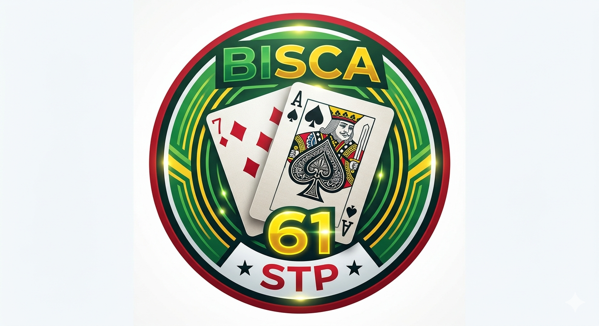

# Bisca 61 — Multijogador
<p align="center">
  
</p>
## Estrutura de Ficheiros

```
bisca61/
├── index.html          ← Frontend principal (única página)
├── api/
│   ├── db.php          ← Configuração da BD e helpers
│   ├── auth.php        ← Login / sessão
│   ├── sala.php        ← Gestão de salas + jogadas
│   └── engine.php      ← Motor de jogo (regras Bisca)
└── README.md
```

## Instalação

### 1. Base de Dados
Execute o SQL fornecido no phpMyAdmin (base: `bisca61`).

### 2. Configurar credenciais
Edite `api/db.php`:
```php
define('DB_HOST', 'localhost');
define('DB_NAME', 'bisca61');
define('DB_USER', 'root');   // ← o seu utilizador MySQL
define('DB_PASS', '');       // ← a sua password MySQL
```

### 3. Servidor Web
Coloque a pasta `bisca61/` dentro do `htdocs` (XAMPP) ou `www` (WAMP/Laragon).

Aceda a: `http://localhost/bisca61/`

## Como Jogar

### Criar uma sala
1. Faça login com um nome e avatar
2. Escolha **2 jogadores** (individual) ou **4 jogadores** (duplas)
3. Clique **Criar Sala**
4. Partilhe o **código de 6 letras** com os amigos

### Entrar numa sala
1. Faça login
2. Cole o código no campo "Entrar com Código" — ou escolha da lista de salas abertas

### Durante o jogo
- O **host** (quem criou) inicia o jogo quando a sala estiver completa
- A mesa circular no centro mostra as cartas jogadas
- O **trunfo** aparece virado à direita da mesa
- As **costas das cartas** dos adversários mostram quantas cartas têm
- Clique na sua carta para a jogar

## Regras
- Baralho de 40 cartas (sem 8, 9, 10)
- Ás=11pts · Sete=10pts · Rei=4pts · Valete=3pts · Dama=2pts
- Quem fizer 61+ pontos ganha
- 4 jogadores: Slots 0+2 (Azul) vs Slots 1+3 (Vermelho)

## Tecnologias
- **Frontend**: HTML5 / CSS3 / JS vanilla (sem frameworks)
- **Backend**: PHP 8+ (sem Composer necessário)
- **BD**: MySQL / MariaDB (phpMyAdmin)
- **Comunicação**: Polling a cada 1.2s (jogo) / 2s (sala de espera)
